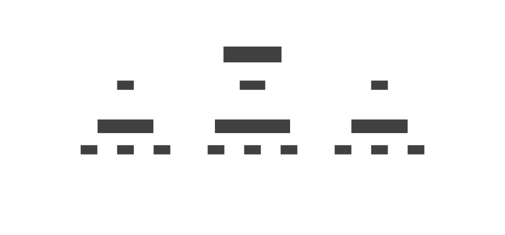

## Introduction

In this blog post, we will explore the development of a Command Line Interface (CLI) Music Player using the C programming language. This project will help you understand various data structures and algorithms, particularly focusing on the implementation of a double linked list and the architecture of a music player which can be used to play music files. 

## Why a CLI Music Player?

Creating a CLI Music Player is an excellent way to practice and enhance programming skills in C. It involves managing data structures, and implementing algorithms to manipulate and play music files. Additionally, it provides a practical application of theoretical concepts.

## Setting Up the Project

To get started, ensure I have a C compiler installed on my system. I can use GCC compiler, which is available on most platforms. Create a new directory for your project and initialize it with the necessary files.

### Linux
```bash
sudo apt install gcc
mkdir music-player
cd music-player
```

### Windows (MinGW)
```powershell
scoop install w64devkit # Install MinGW using Scoop sometime not latest version 
mkdir music-player
cd music-player
```
or download from [GitHub](https://github.com/skeeto/w64devkit) and Set the PATH Environment Variable. 

#### Ways to Set PATH
1. [How to set PATH Tutorial](https://www.architectryan.com/2018/03/17/add-to-the-path-on-windows-10/) 
2. Add `<path-to-w64devkit>\w64devkit\bin` to PATH.

## Implementation of the Music Player

### Software Architecture


The music player will be implemented in two parts: the frontend and the backend. The frontend will handle the user interface and interaction, while the backend will manage the music files and playback.

### Frontend Implementation

#### Basic UI Implementation

##### Main Menu Implementation
Main menu is the first screen that the user will see when they start the music player. It will display the available options and allow the user to navigate through the application.

```c
int MainMenu()
{
	printf("Welcome to Music Player 1.0\n");
	printf("1. Select song from the Song List\n");
	printf("2. Play the selected song\n");
	printf("3. Next song\n");
	printf("4. Previous song\n");
	printf("5. Display the current Playlist\n");
	printf("6. Delete the current song\n");
	printf("7. Delete Song from the PlayList\n");
	printf("8. Exit\n");
	return getValidInt(1, 8, "Enter your choice: ");
}
```

Main menu will display the available options and prompt the user to enter a choice. The `getValidInt` function is used to validate the user input and ensure that it is within the specified range.

```c
int getValidInt(int min, int max, char *message)
{
	int input;
	do
	{
		printf("%s", message);
		scanf("%d", &input);
		if (input < min || input > max)
		{
			printf("Invalid input. Please enter a number between %d and %d.\n", min, max);
		}
	} while (input < min || input > max);
	return input;
}
```

The `getValidInt` function will keep prompting the user to enter a number until a valid input is provided. Next, we will put it all together in the `main` function.

```c
int main()
{
	List *list = newList();
	Cursor *cursor = newCursor();
	for(;;){
		switch (MainMenu())
		{
		case 1:
			// Add song to the playlist
			break;

		case 2:
			// Play the selected song
			break;

		case 3:
			// Play the next song
			break;

		case 4:
			// Play the previous song
			break;

		case 5:
			// Display the current playlist
			break;

		case 6:
			// Delete the current song
			break;

		case 7:
			// Delete song from the playlist
			break;

		case 8:
			// Exit the application
			exit(0);
			break;
		}
		printf("Press any key to continue . . .");
		getch(); // #include <conio.h>
	};
	return 0;
}
```

The `main` function will display the main menu and prompt the user to enter a choice. Based on the user's input, it will call the corresponding function to perform the desired action. The `do-while` loop will keep the application running until the user chooses to exit.

#### Playlist Implementation (Doubly Linked List)

A double linked list is a data structure that allows traversal in both directions. It is ideal for managing the playlist in our music player. Below is a simple implementation of a double linked list in C.

```c
#include <stdio.h>
#include <stdlib.h>

typedef struct
{
	string name;
} Song;

struct node
{
	struct node *prev;
	Song data;
	struct node *next;
};

typedef struct node Node;

typedef struct PLAYLIST
{
	Node *head;
	Node *tail;
	int size;
} List;

Node *newNode()
{
	Node *node = (Node *)malloc(sizeof(Node));
	node->prev = NULL;
	node->next = NULL;
	return node;
}

List *newList()
{
	List *list = (List *)malloc(sizeof(List));
	list->head = NULL;
	list->tail = NULL;
	list->size = 0;
	return list;
}

void addSong(List *list, Node *node)
{
	if (list->head == NULL)
	{
		list->head = node;
		list->tail = node;
	}
	else
	{
		list->tail->next = node;
		node->prev = list->tail;
		list->tail = node;
	}
	list->size++;
}

void printPlayList(List list, Cursor cursor)
{
	Node *node = list.head;
	printf("+---------+---------------------------------------------------------------+\n");
	printf("|  Index  |                             Title                             |\n");
	printf("+---------+---------------------------------------------------------------+\n");
	int index = 1;
	char buffer[MAX_INDEX];
	while (node != NULL)
	{
		snprintf(buffer, MAX_INDEX, "%d", index);
		printf("| %7s | %61s |\n", index == cursor.index ? " * " : buffer, node->data.name);
		node = node->next;
		index++;
	}
	printf("+---------+---------------------------------------------------------------+\n");
}
```

#### Cursor Implementation

##### Cursor Definition
The cursor feature allows the user to navigate through the playlist and select a song to play. It keeps track of the current position in the playlist and provides methods to move to the next or previous song. The cursor structure is defined as follows:

```c
typedef struct CURSOR
{
	Node *node;
	int index;
} Cursor;
```

##### Next and Previous Song
Before we implement the `next` and `prev` functions, we need to define a helper function to check if the cursor is currently pointing to a song in the playlist.

```c
int isSelected(Cursor *cursor)
{
	if (cursor->node == NULL)
	{
		printf("No song selected.\n");
		return 0;
	}
	return 1;
}
```

The `next` and `prev` functions will move the cursor to the next and previous songs in the playlist, respectively. Because the doubly linked list allows traversal in both directions, we can easily implement these functions.
```c
void next(Cursor *cursor)
{
	// Check if the cursor is at the end of the playlist
	if (!isSelected(cursor))
		return;

	// Move the cursor to the next song
	if (cursor->node->next == NULL)
	{
		printf("This is the last song.\n");
		return;
	}

	// Move the cursor to the next song
	cursor->node = cursor->node->next;
	cursor->index++;
	clearScreen();
}

void prev(Cursor *cursor)
{
	if (!isSelected(cursor))
		return;

	if (cursor->node->prev == NULL)
	{
		printf("This is the first song.\n");
		return;
	}
	cursor->node = cursor->node->prev;
	cursor->index--;
	clearScreen();
	printf("Playing %s\n", cursor->node->data.name);
}
```
##### Example of the Playlist


### Backend Implementation

#### Player Implementation

Next, we will build the core functionality of the music player. This includes loading songs, playing, pausing, and stopping playback. We will use the double linked list to manage the playlist. Now, we define the player structure and the corresponding functions.

```c
struct Player
{
	ma_sound sound;
	ma_engine engine;
} player;
```

The `Player` structure contains the `miniaudio` sound and engine objects, which are used to play audio files. We will implement the following `play` function to play the selected song.

```c
void play(const char *path)
{
	char buffer[strlen(path) + strlen("./music/") + strlen(".mp3") + 1];
	strcpy(buffer, "./music/");
	strcat(buffer, path);
	strcat(buffer, ".mp3");

	stop();

	ma_result result;

	result = ma_engine_init(NULL, &player.engine);
	if (result != MA_SUCCESS)
	{
		printf("Failed to initialize audio engine.");
		exit(1);
	}

	result = ma_sound_init_from_file(&player.engine, buffer, 0, NULL, NULL, &player.sound);
	if (result != MA_SUCCESS)
	{
		printf("Failed to load sound file.");
		exit(1);
	}
	ma_sound_set_looping(&player.sound, MA_TRUE);
	ma_sound_start(&player.sound);
}
```

The `play` function takes the path to the audio file as an argument and plays the file using the `miniaudio` library. It first stops the current playback, initializes the audio engine, and loads the sound file. Finally, it starts playing the sound.

#### Stop Function

The `stop` function stops the current playback and cleans up the audio engine and sound objects.

```c
void stop()
{
	if (ma_sound_is_playing(&player.sound))
	{
		ma_sound_stop(&player.sound);
	}
	ma_sound_uninit(&player.sound);
	ma_engine_uninit(&player.engine);
}
```

The `stop` function checks if the sound is currently playing and stops it. It then uninitializes the sound and engine objects.

## Conclusion

In this blog post, we have laid the foundation for a CLI Music Player using C. We discussed the importance of such a project, set up the project structure, and implemented a double linked list to manage the playlist. In future posts, we will expand on this by adding more features and improving the user interface.

Stay tuned for more updates and happy coding!

## References
- [GitHub Repository](https://github.com/XPH0816/DSA-Project)