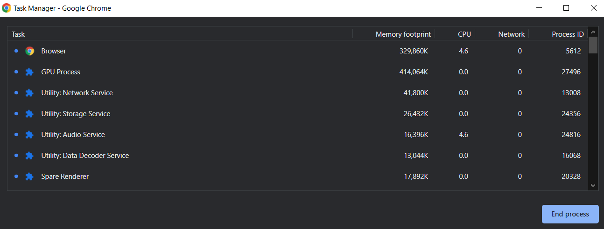
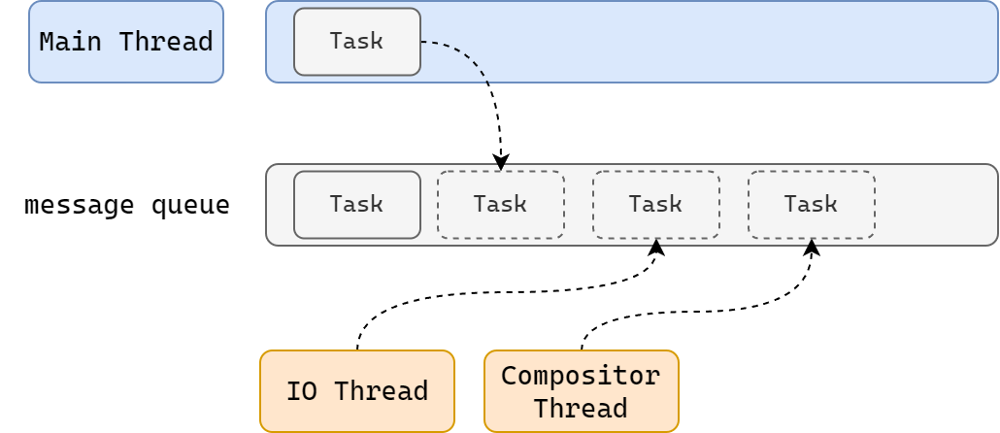
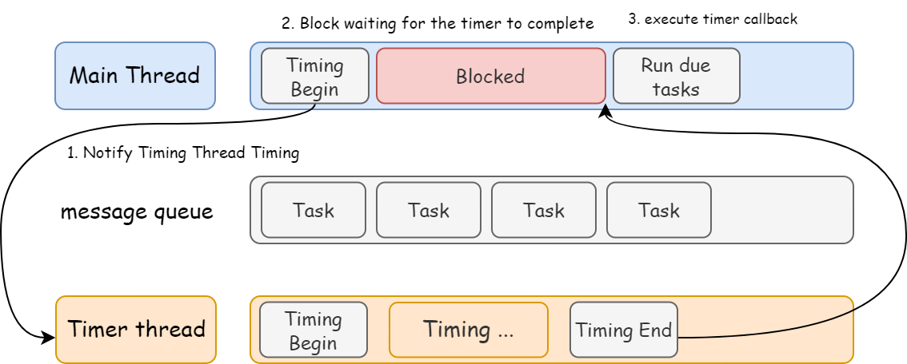
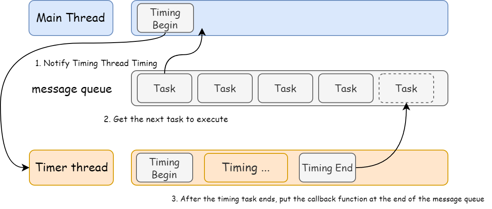
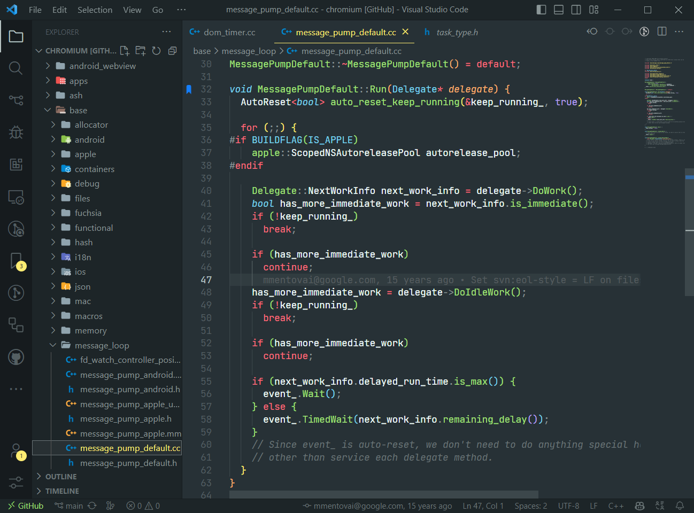

## Process Model of Browser
---
### What is a Process?
Every program has their own memory space, and the program can only access the memory space of itself. This memory space is called **Process**.

Each program has at least one process, and processes are isolated from each other. If a program wants to access the memory space of another program, it must use **Inter-Process Communication**, and need to be authorized by the operating system.

---
### What is a Thread?
Once a process is created, it will have at least one thread, which is called **Main Thread**.
If the program wants to do multiple things at the same time, it needs to create multiple threads.

---

### Browser have which processes and threads?
Browser is a multi-process and multi-threaded program.
Multi-process uses to reduce the risk of crash, when open the browser, it will automatically create many processes.
The main processes are:
- Browser Process
- Network Process
- Renderer Process
- GPU Process
- Storage Service Process
- Audio Service Process



The Most important processes are:
1. Browser Process
    - Mainly responsible for interface display, user interaction, sub-process management, etc. The browser process will start multiple threads to handle different tasks.
2. Network Process
    - Responsible for loading network resources. The network process will start multiple threads to handle different network tasks.
3. **Renderer Process** (The main process we will talk about in this lesson)
    - After the renderer process is started, it will open a **Renderer Main Thread**, which is responsible for executing HTML, CSS, and JS code.
    - By default, the browser will open a new renderer process for each tab to ensure that different tabs do not affect each other.
    > This default mode may change in the future. Interested students can refer to the [chrome official documentation](https://chromium.googlesource.com/chromium/src/+/main/docs/process_model_and_site_isolation.md#Modes-and-Availability)


---

### How does the Renderer Main Thread work?
The renderer main thread is the busiest thread in the browser. The tasks it needs to handle include but are not limited to:
- Parse HTML
- Parse CSS
- Calculate style
- Layout
- Paint
- Compositing
- Every frame rendering (60fps)
- Execute JS code
- Handle user interaction
- Handle timer events
- Handle network events
- ...... and more

> Q: Why render process don't use multiple threads to handle these tasks?

> A: Because the tasks are related to each other, and the order of execution is very important. If multiple threads are used to handle these tasks, it will be very difficult to ensure the order of execution.

Main render thread faces a lot of tasks, and how does it schedule these tasks?
example: 
- When the main thread is executing a JS code, how does it handle the user's click event?
- When the main thread is executing a JS code, the timer event is triggered, how does it handle the timer event?
- Browser process annouce that user click a button, and the same time, the timer event is triggered, how does the main thread handle these two events?
- ...

Main thread use message queue to schedule these tasks.



1. From the beginning, main thread will enter the **Event Loop**.
2. Event Loop will check if there is any task in the **Message Queue**. If there is a task, it will take the task out of the message queue and execute it immediately. If not, it will wait for the task to be added to the message queue and enter the sleep state.
3. Other threads (including other threads in the other processes) can add tasks to the message queue at any time. New tasks will be added to the end of the message queue. When new tasks are added, the main thread will wake up and take the task out of the message queue and execute it immediately.

In this way, each task can be carried out in an orderly and continuous manner

**The Whole Process is called Event Loop**

## Some Explaination

### What is Asynchronous?
Code in execution, there will be some tasks that cannot process immediately, Example:
- Tasks that need to be performed after the timer is triggered -- `setTimeout`, `setInterval`
- Tasks that need to be performed after the network request is completed -- `fetch`, `XMLHttpRequest`
- Tasks that need to be performed after the user action is triggered -- `addEventListener`
if main thread wait for these tasks to complete, it will block the main thread, and the main thread will not be able to handle other tasks, which will cause the page to freeze.



**Main thread focus on most important tasks, it must not be blocked.**
So, browser will use **Asynchronous** to handle these tasks.
Use **Asynchronous** to handle these tasks, the main thread will not be blocked.



> Q: How do understand the asynchrony of JS?
>
> Answer: JS is a single-threaded language, this is because the execution of JS code is performed in the main thread and main render thread is just only one thread and the main render thread need to handle a lot of tasks, like rendering, executing JS code, handling user interaction, handling timer events, handling network events, etc. Using synchronous to handle these tasks, the busy main thread will waste time in vain, and on the other hand, the page cannot be updated in time, causing the user to be stuck in the page. So the browser uses an asynchronous way to avoid it. The specific method is that when certain tasks occur, such as timers, network, and event monitoring, the main thread will hand over the tasks to other threads for processing, and immediately end the execution of the tasks by itself, and then execute subsequent codes. When other threads complete, wrap the callback function passed in advance into a task, add it to the end of the message queue, and wait for the main thread to schedule execution. In this asynchronous mode, the browser will never block, thus ensuring the smooth operation of single thread to the greatest extent.

### How JS block the rendering?

Here is an example:
```html
<h1>Hello World!</h1>
<button>change</button>
<script>
var h1 = document.querySelector('h1');
var btn = document.querySelector('button');
// 死循环指定的时间
function delay(duration) {
var start = Date.now();
while (Date.now() - start < duration) {}
 }
btn.onclick = function () {
h1.textContent = 'Don’t want to Hello the World！';
delay(3000);
 };
</script>
```
After click the button, the h1 text will change after 3 seconds.

### Priority of the Message Queue

Task don't have priority, the message queue is FIFO (First In First Out).

But the message queue has priority.

According to Latest W3C standard:
- Every Task has a task type, the same task type must in the same queue, different task type must in different queue. In the Event Loop, browser will based on the task type to execute the task.
- The browser must prepare a micro-queue, and tasks in the micro-queue are executed prior to all other tasks https://html.spec.whatwg.org/multipage/webappapis.html#perform-a-microtask-checkpoint

> As the complexity of browsers has increased dramatically, the W3C no longer uses the term macro queue.

In the Chrome browser, the message queue is divided into various types:
- Timer Task Queue: used to store the callback task after the timer arrives, the priority is "medium"
- User Interaction Task Queue: used to store the callback task after the user interaction event is triggered, the priority is "high"
- Micro Task Queue: used to store micro tasks, the priority is "highest"

> Method to add micro task is to use `Promise, MutationObserver`
>
> 
>
> Example:
>
> ```js
> // Add a function to the micro task immediately
> Promise.resolve().then(fn)
> ```

> There are many other queues in the browser, which are not considered because they have little to do with our development

> Interview Question: Explain the event loop of JS
>
> 
>
> Answer:
>
> **Event Loop** a.k.a **Message Loop**, is the way the browser's rendering main thread works
>
> In the Source Code of Chromium, it opens an endless for loop, and each loop will take the first task from the message queue and execute it, and other threads only need to add tasks to the end of the queue at the right time.
>
> In the past, the message queue was simply divided into macro queues and micro queues. This statement is no longer applicable to the complex browser environment. Instead, it is a more flexible and changeable processing method.
>
> According to the official explanation of W3C, each task has a different type, and tasks of the same type must be in the same queue, and tasks of different types can belong to different queues. Different task queues have different priorities. In one event loop, the browser can decide which queue to take tasks from according to the actual situation. However, the browser must have a micro queue, and the tasks in the micro queue must have the highest priority and must be scheduled for execution first.

> Interview Question: Can the timer in JS be accurate? Why?
>
> 
>
> Answer:
>
> Cannot be accurate, because:
>
> 1. Computer hardware does not have an atomic clock, so it cannot be timed accurately.
> 2. The timing function of the operating system itself has a small deviation. Since the timer of JS ultimately calls the function of the operating system, it also carries these deviations
> 3. According to the W3C standard, when the browser implements the timer, if the nesting level exceeds 5 layers, it will have a minimum time of 4 milliseconds, which will bring deviations when the timing time is less than 4 milliseconds
> 4. Affected by the event loop, the callback function of the timer can only run when the main thread is idle, which brings deviations again


